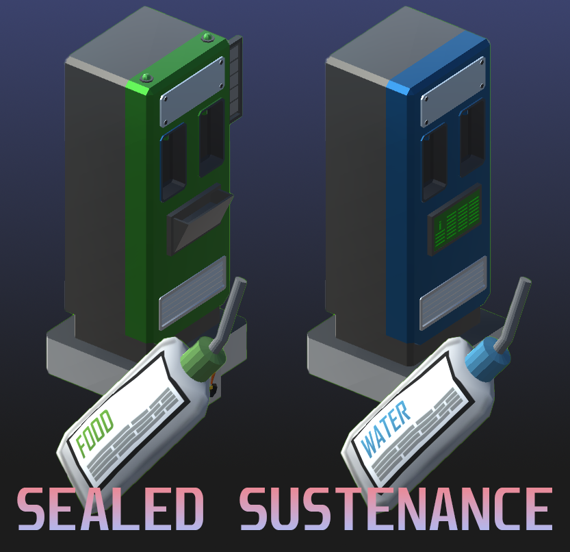

# Sealed Sustenance

This mods add new items and structures to create food and water that can be used with the space suit helmet closed.

# Required

- [Stationeers Launch Pad](https://github.com/StationeersLaunchPad/StationeersLaunchPad/)
- [BepInEx](https://github.com/BepInEx/BepInEx)

# Items Added

Two new items were added. These items store either food or water and can be used with your helmet closed.

- Nutrient Gel
- Sealed Water

# Structures Added

Two dispensers have been added to refill your sustenance.

### Sealed Water Dispenser (Blue)

> Works just like a Water Bottle Filler. Connect a Liquid Pipe to it with a supply of water and then you can refill your Sealed Water.

### Nutrient Gel Dispenser (Green)

> This is a device that converts Food (cooked food) into its base nutrients. These nutrients are then stored inside the dispenser and can be used to refil your Nutrient Gels.
